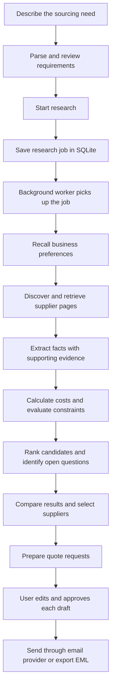
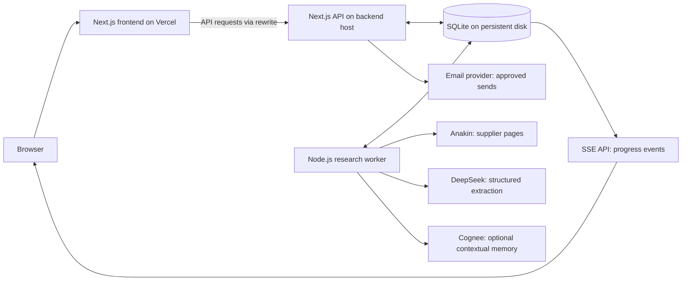

# SupplySaathi

**Find replacement suppliers. Compare the evidence. Request quotes with confidence.**

SupplySaathi is an AI-assisted sourcing application for small businesses facing supplier stockouts. Describe what you need, and it researches supplier pages, checks requirements, compares costs, and prepares quote requests for your approval.

The current implementation focuses on bakery packaging in India.

[Frontend](https://supplysaathi.vercel.app/) · [Deployment guide](./DEPLOYMENT.md) · [Provider setup](./PROVIDERS.md)

## What it does

Imagine a bakery needs **500 cake boxes, 10 × 10 × 5 inches, by Friday** because its regular supplier cancelled.

SupplySaathi helps the owner:

1. Turn the request into structured requirements: quantity, dimensions, budget, and deadline.
2. Review the interpreted requirements and answer relevant clarification questions.
3. Research alternative supplier pages and collect supporting excerpts.
4. Compare pack sizes, minimum orders, known costs, and requirement matches.
5. Review ranked candidates and see what is confirmed, missing, or incompatible.
6. Select suppliers and prepare tailored requests for quotation (RFQs).
7. Edit and approve each draft before sending through a configured email provider, or export it as an `.eml` file.

It supports sourcing decisions; it does not place purchase orders or guarantee supplier availability, certification, or delivery.

## System flow



During research, the worker saves progress events and results to SQLite. The browser receives timeline updates through **Server-Sent Events (SSE)**, so the user can follow the work without repeatedly refreshing the page.

### How a supplier is evaluated

| Result | Meaning | Example |
| --- | --- | --- |
| Match | The available evidence satisfies the requirement | Listed dimensions match the requested box |
| Failed | The evidence conflicts with the requirement | Minimum order is 5,000 when the request allows only 500 |
| Unknown | The page does not provide enough information | Delivery time is not published |

Unknown information stays visible and becomes a question for the supplier. Missing shipping costs are not treated as zero, and a supplier's safety claim is not treated as independent certification.

Cost calculations run in ordinary TypeScript code. For example, **500 boxes ÷ 50 boxes per pack = 10 packs**. The application also accounts for minimum orders and order increments when that information is available.

## Architecture

The repository contains one Next.js application and a separate Node.js research worker.



- **Frontend:** displays the sourcing form, cases, evidence, comparisons, drafts, and settings.
- **API:** validates requests and manages cases, research jobs, preferences, approvals, and sends.
- **Worker:** polls the database for queued research jobs and performs the longer research workflow outside a web request.
- **SQLite:** stores the authoritative case data, requirements, evidence, results, jobs, events, and approval records.
- **SSE:** streams saved progress events to the browser. Reconnecting clients can resume from their last event sequence.

Closing the browser does not stop the worker. On startup, the worker requeues jobs left running by an interrupted process. This recovery model assumes a single worker instance.

## Technologies and their roles

| Technology | What it does in this project |
| --- | --- |
| **Next.js 15** | Provides page routing, server rendering, API route handlers, and the frontend-to-backend API rewrite |
| **React 19** | Builds interactive forms, supplier cards, comparison views, and the research workspace |
| **TypeScript** | Defines shared data types and implements the research workflow, calculations, and business rules |
| **Tailwind CSS 4** | Styles the interface and responsive layouts |
| **Node.js** | Runs the web server, scripts, and separate background worker |
| **SQLite via `node:sqlite`** | Persists application data in a local database file without a separate database server |
| **Zod** | Validates structured data, including model responses, before application code uses it |
| **Anakin adapter** | Searches for supplier pages and retrieves their content, depending on available provider capabilities |
| **DeepSeek adapter** | Helps plan searches and extract structured facts from supplier text; rule-based processing provides a fallback |
| **Cognee adapter** | Adds optional contextual recall of preferences and supplier notes alongside local memory |
| **Nodemailer / Resend** | Supports sending user-approved quote requests through SMTP or Resend |
| **Vitest** | Tests business rules, authentication, research behavior, and outreach safeguards |
| **Docker** | Packages the API and worker for a backend host with a persistent disk |

The AI interprets text. The application code calculates costs, evaluates constraints, manages state, and enforces approval rules. SQLite remains the source of truth even when external AI or memory services are unavailable.

## Demo and live modes

| Mode | Data and behavior |
| --- | --- |
| **Demo** | Uses sample supplier fixtures and deterministic reasoning to demonstrate research and comparison without live supplier research |
| **Live** | Uses real supplier pages and available provider integrations; failed retrievals remain failures rather than becoming sample results |

Mode is selected per case. `APP_MODE` controls the default shown in the interface.

DeepSeek is optional: without its key, the application uses rule-based reasoning. Anakin discovery can fall back to a curated catalogue and supplied URLs; actual retrieval still depends on the provider being available. Use the Settings page or `npm run doctor` to check configured capabilities.

For a demonstration without outgoing email, keep `EMAIL_PROVIDER=none`.

## Run locally

**Requirements:** Node.js **22.5 or newer** and npm. The minimum Node version is needed for the built-in SQLite API.

### 1. Install dependencies

```bash
npm install
```

### 2. Create the local environment file

Copy `.env.example` to `.env.local` if you do not already have one.

PowerShell:

```powershell
Copy-Item .env.example .env.local
```

macOS / Linux:

```bash
cp .env.example .env.local
```

Start with these values:

```dotenv
APP_MODE=demo
DATABASE_PATH=./data/supplysaathi.db
APP_TIMEZONE=Asia/Kolkata
APP_BASE_URL=http://localhost:3000
APP_AUTH_ENABLED=false
EMAIL_PROVIDER=none
```

### 3. Initialize the database and start the application

```bash
npm run migrate
npm run dev
```

Open [localhost:3000](http://localhost:3000). Choose the demo option, enter a sourcing request, create the case, and start research.

`npm run dev` starts **both the web app and the worker**. Running only `npm run dev:web` does not process research jobs.

## Configuration

See [.env.example](./.env.example) for all available variables and [PROVIDERS.md](./PROVIDERS.md) for integration setup. Keep credentials in server-side environment variables; do not commit `.env.local`.

| Variable | Purpose |
| --- | --- |
| `APP_MODE` | Default case mode: `demo` or `live` |
| `DATABASE_PATH` | SQLite file location; use persistent storage on the backend |
| `APP_TIMEZONE` | Timezone used when interpreting dates |
| `APP_BASE_URL` | Public application URL, also used by backend request-origin checks |
| `API_ORIGIN` | Backend origin for the frontend's `/api/*` rewrite; leave unset on the backend |
| `APP_AUTH_ENABLED` | Enables the application's shared password gate when `true` |
| `APP_AUTH_PASSWORD` | Password used by the gate when enabled |
| `ANAKIN_API_KEY` | Credentials for supported web research capabilities |
| `DEEPSEEK_API_KEY` | Enables model-assisted reasoning in live mode |
| `DEEPSEEK_MODEL` | Configurable model identifier for the DeepSeek adapter |
| `COGNEE_API_KEY`, `COGNEE_BASE_URL` | Optional remote contextual memory |
| `EMAIL_PROVIDER` | `none`, `smtp`, `resend`, or `test` |
| `EMAIL_ALLOWLIST` | Optional restriction on outgoing recipients |
| `AGENT_MAX_PAGES`, `AGENT_MAX_ROUNDS`, `AGENT_TIME_BUDGET_MS` | Bounds on research work |

## Deployment

The deployment setup included in this repository is:

| Component | Host | Configuration |
| --- | --- | --- |
| Frontend | Vercel | Set `API_ORIGIN` to the backend URL |
| API and worker | Render Docker service | Leave `API_ORIGIN` unset; run both processes together |
| Database | Persistent disk attached to the backend | Set `DATABASE_PATH` to the mounted file path |

The frontend forwards `/api/*` requests to the backend through `next.config.mjs`. Provider keys belong on the backend. Set the backend's `APP_BASE_URL` to the public frontend URL.

**The current backend is designed for a persistent server process and shared SQLite disk.** Deploying another copy of the project as a serverless frontend does not replace that runtime: the API and worker must share durable storage, and the worker must keep running. Moving this architecture to a serverless backend requires changes to database storage and job execution.

Follow [DEPLOYMENT.md](./DEPLOYMENT.md) for the full setup.

### Password prompt

The deployment guide describes a password-protected setup. For public access without the application's password prompt, set `APP_AUTH_ENABLED=false` on **both** frontend and backend deployments, then redeploy both. This opens access to the shared workspace; the project does not have individual user accounts.

A Vercel-branded login page is a separate hosting-level protection setting, not the application's password gate.

## Available commands

| Command | Purpose |
| --- | --- |
| `npm run dev` | Start the web app and worker with automatic reload |
| `npm run dev:web` | Start only the Next.js development server |
| `npm run worker` | Start the worker with automatic reload |
| `npm run build` | Build the Next.js application |
| `npm start` | Apply migrations and start the production web app and worker |
| `npm run migrate` | Apply database migrations |
| `npm run seed` | Add sample data for local demonstrations |
| `npm run doctor` | Probe provider availability; may contact external services |
| `npm test` | Run the Vitest test suite |
| `npm run typecheck` | Check TypeScript types |

## Project structure

```text
src/
  app/                  Pages and API route handlers
  components/           Forms, supplier cards, and workspace views
  lib/
    agent/              Research orchestration, briefs, and outreach
    domain/             Costing, constraints, ranking, units, and dates
    providers/          Web, reasoning, memory, and email adapters
    db/                 SQLite connection and data access
    security/           Authentication, URL checks, sanitization, redaction
    config/             Server configuration and environment loading
    client/             Browser API helpers
    fixtures/           Sample supplier pages for demo research
  middleware.ts         Optional application password gate
worker/                 Background research job loop
migrations/             SQL database migrations
scripts/                Migration, seed, and provider-check utilities
tests/                  Automated tests
Dockerfile              Backend container image
render.yaml             Backend service and disk configuration
next.config.mjs         Frontend-to-backend API routing
```

## Reliability and limitations

- Extracted facts carry supporting evidence where available; incomplete information remains visible as unknown.
- Editing an approved draft revokes its approval. Sending requires approval of the current content and recipient.
- Send records and idempotency checks help prevent duplicate submissions. An uncertain send outcome is not automatically retried.
- Email provider acceptance is recorded separately from confirmed delivery.
- External model output is schema-validated, with a rule-based fallback for reasoning failures.
- Research has page, round, and time budgets and can return partial results.
- The current catalogue and extraction heuristics focus on bakery packaging in India.
- This is a single shared business workspace with a single-worker recovery model, not a multi-tenant application.
- Published prices and lead times can change; missing shipping, tax, or delivery information must be confirmed with the supplier.
- Live integration availability depends on provider credentials, permissions, quotas, and service status. Demo results do not verify live integrations.

## Development checks

```bash
npm run typecheck
npm test
npm run build
```

The test suite covers costing, constraint evaluation, date handling, authentication, URL and content handling, research recovery, listing extraction, provider health, and approval/send behavior. Run the commands above to verify your checkout; external provider availability is checked separately with `npm run doctor`.
